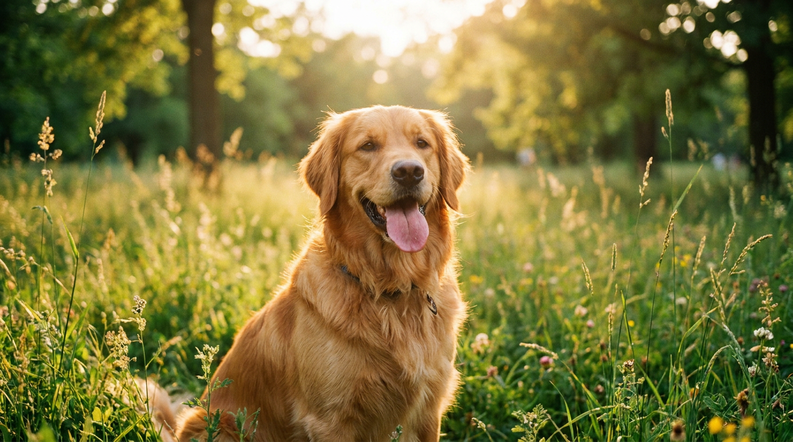

```{r}
#| label: graphic
#| fig-width: 9
#| fig-height: 6

library(tidyverse)

dogs <- read_csv("golden_retrievers.csv", show_col_types = FALSE) |> 
  mutate(Gender = factor(Sex))

dogs |> 
  ggplot(aes(x = Age_at_enrollment_years, y = Age_current_years, color = Gender)) +
  geom_point(alpha = 0.4, size = 1.8) +
  geom_smooth(method = "lm", se = FALSE, linewidth = 1) +
  labs(
    title = "Age at Enrollment vs. Current Age in Golden Retrievers",
    subtitle = "Observations of 3,049 dogs from the Morris Animal Foundation Golden Retriever Lifetime Study",
    x = "Age at Enrollment (years)",
    y = "Current Age (years)",
    color = "Gender"
  ) +
  theme_minimal(base_size = 14) +
  scale_color_brewer(palette = "Set1")
```

This scatter plot displays observations of 3,049 real Golden Retrievers from the Golden Retriever Lifetime Study, illustrating the relationship between enrollment age and current age across genders.

Dogs play an irreplaceable role in human lives, offering loyal companionship, emotional comfort, and unconditional love. Beyond being cherished family members, dogs encourage healthier and more active lifestyles, reduce stress, and frequently serve vital functions as therapy, service, and working partners in our communities.

::::: {.columns}

::: {.column width="60%"}
<label for="breed-select" style="font-weight: 600; margin-bottom: 6px; display: block;">Select a Dog Breed:</label>
<select id="breed-select" class="form-select" style="max-width: 320px; margin-bottom: 15px;" onchange="updateBreedInfo()">
  <option value="golden">Golden Retriever</option>
  <option value="labrador">Labrador Retriever</option>
  <option value="shepherd">German Shepherd</option>
  <option value="beagle">Beagle</option>
  <option value="frenchie">French Bulldog</option>
  <option value="poodle">Standard Poodle</option>
</select>

<div id="breed-info">
### Cool Facts About Golden Retrievers

- **Soft Mouth:** Goldens have an exceptionally gentle grip, famously capable of carrying a raw egg in their mouths without cracking it.
- **Water-Repellent Coats:** They have a dense double coat designed to repel water and keep them warm when retrieving waterfowl in cold lakes and rivers.
- **Top-Tier Smarts:** Ranked the 4th smartest dog breed, they excel in search-and-rescue, service work, and therapy.
- **Longevity and Weight:** While the average life expectancy for a Golden Retriever is around 10 to 12 years, veterinary studies show that keeping them at a lean, healthy weight can add nearly two years to their lifespan!
</div>

<script>
const breedData = {
  golden: {
    title: "Golden Retriever",
    facts: [
      "<strong>Soft Mouth:</strong> Goldens have an exceptionally gentle grip, famously capable of carrying a raw egg in their mouths without cracking it.",
      "<strong>Water-Repellent Coats:</strong> They have a dense double coat designed to repel water and keep them warm when retrieving waterfowl in cold lakes and rivers.",
      "<strong>Top-Tier Smarts:</strong> Ranked the 4th smartest dog breed, they excel in search-and-rescue, service work, and therapy.",
      "<strong>Longevity and Weight:</strong> Average life expectancy is 10 to 12 years; keeping them lean can add nearly two years!"
    ]
  },
  labrador: {
    title: "Labrador Retriever",
    facts: [
      "<strong>America's Longtime Favorite:</strong> Held the #1 most popular breed spot in the US for over 30 consecutive years.",
      "<strong>Otter Tail:</strong> Their thick, rudder-like tail helps them steer powerfully through water.",
      "<strong>Friendly Nature:</strong> Famous for an outgoing, patient demeanor that makes them outstanding family and assistance dogs.",
      "<strong>Longevity:</strong> Average life expectancy is roughly 11 to 13 years."
    ]
  },
  shepherd: {
    title: "German Shepherd",
    facts: [
      "<strong>All-Purpose Working Dogs:</strong> The world's leading breed for police, military, and search-and-rescue work.",
      "<strong>Loyalty and Courage:</strong> Exceptionally devoted guardians who form tight bonds with their families.",
      "<strong>Eager Learners:</strong> Capable of mastering complex commands and multi-step routines with ease.",
      "<strong>Longevity:</strong> Average life expectancy is between 9 and 13 years."
    ]
  },
  beagle: {
    title: "Beagle",
    facts: [
      "<strong>Scent Superpower:</strong> Possesses around 220 million scent receptors, making them legendary tracking hounds.",
      "<strong>Airport Defenders:</strong> Frequently chosen for the USDA 'Beagle Brigade' to detect contraband agricultural items.",
      "<strong>Merry Temperament:</strong> Cheerful and pack-friendly, known for their vocal howl and loving personality.",
      "<strong>Longevity:</strong> Average life expectancy is 12 to 15 years."
    ]
  },
  frenchie: {
    title: "French Bulldog",
    facts: [
      "<strong>Bat Ears:</strong> Instantly recognizable by their large, upright bat ears and compact frame.",
      "<strong>Quiet City Companions:</strong> Rarely bark, making them well-suited for apartments and urban living.",
      "<strong>Affectionate Clowns:</strong> Playful and humorous lap dogs who thrive on human interaction.",
      "<strong>Longevity:</strong> Average life expectancy is around 10 to 12 years."
    ]
  },
  poodle: {
    title: "Standard Poodle",
    facts: [
      "<strong>Genius Level:</strong> Ranked the 2nd smartest dog breed across all canine breeds.",
      "<strong>Hypoallergenic Coat:</strong> Non-shedding coat that makes them popular with allergy sufferers.",
      "<strong>Historic Water Dogs:</strong> Originally bred in Germany to retrieve ducks from water.",
      "<strong>Longevity:</strong> Average life expectancy is 12 to 15 years."
    ]
  }
};

function updateBreedInfo() {
  const breed = document.getElementById('breed-select').value;
  const data = breedData[breed];
  if (!data) return;
  
  let html = `<h3>Cool Facts About ${data.title}s</h3><ul>`;
  data.facts.forEach(fact => {
    html += `<li>${fact}</li>`;
  });
  html += `</ul>`;
  document.getElementById('breed-info').innerHTML = html;
}
</script>
:::

::: {.column width="40%"}

:::

:::::

